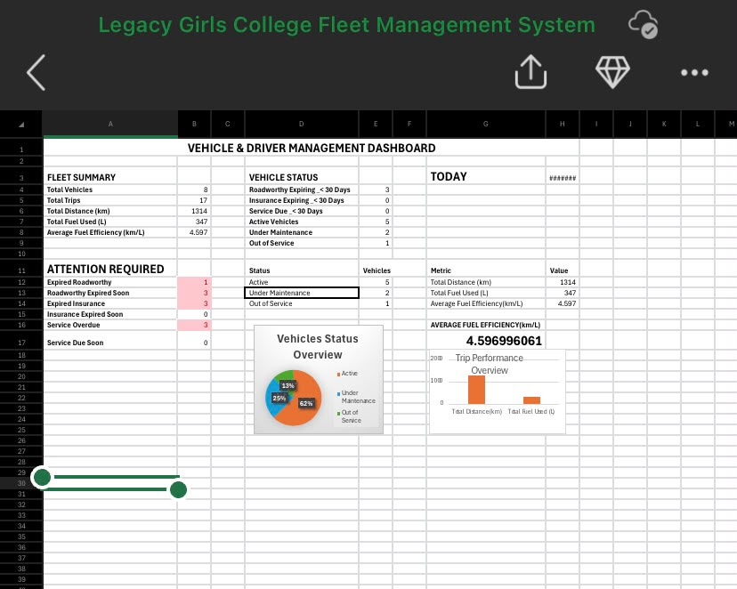
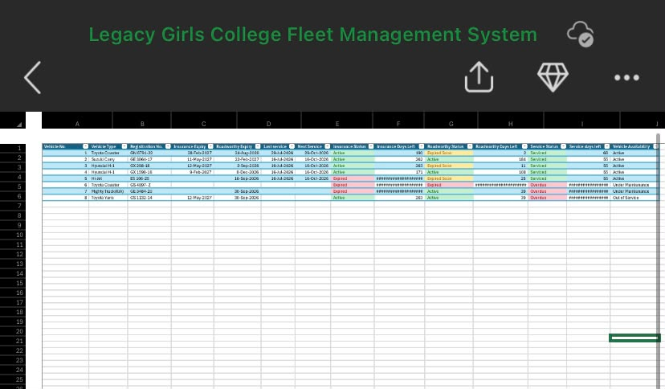

# Excel Fleet Management Dashboard
## Dashboard Preview

### Fleet Management Dashboard

### Vehicle Register

## Project File

The Excel workbook used to create this project is available in this repository:

**Fleet_Management_Dashboard.xlsx**
## Project Overview

This project is a practical Microsoft Excel fleet management dashboard designed to organize vehicle information, monitor vehicle status, track service requirements, and provide a clear overview of fleet operations.

The project demonstrates my ability to organize data, use Excel for operational reporting, create dashboard summaries, and present information in a clear and practical format.

## Fleet Summary

The fleet contains:

- 8 vehicles in total
- 5 active vehicles
- 3 vehicles under maintenance

## Key Features

- Vehicle register
- Vehicle status tracking
- Service days remaining
- Maintenance monitoring
- Attention Required section
- Fleet summary
- Vehicle status visualization
- Dashboard reporting
- Excel formulas and data organization

## Dashboard Sections

### Fleet Summary

Provides an overview of the number of vehicles in the fleet.

### Attention Required

Highlights vehicles that require maintenance or other attention.

### Vehicle Status

Provides a visual summary of the current status of the fleet.

### Service Days Left

Tracks the number of days remaining before a vehicle requires servicing.

## Skills Demonstrated

- Microsoft Excel
- Data organization
- Data analysis
- Dashboard creation
- Charts and visualization
- Spreadsheet formulas
- Fleet data management
- Operational reporting
- Problem solving

## Project Purpose

The purpose of this project was to create a simple and practical system that makes fleet information easier to monitor and understand.

It demonstrates how Microsoft Excel can be used to support real-world operational decision-making.

## Project File

The Excel workbook used to create this project is available in this repository:

**Fleet Management Dashboard.xlsx**

## Future Improvements

Possible future improvements include:

- Automated maintenance reminders
- Additional fleet performance metrics
- Fuel consumption tracking
- Driver assignment tracking
- Service history
- Automated dashboard updates
- Data validation and enhanced reporting

## Author

**Fiavi Yaw Mathias**

Aspiring IT Support Technician

Accra, Ghana

LinkedIn: [linkedin.com/in/fiaviyawmathias](https://linkedin.com/in/fiaviyawmathias)
